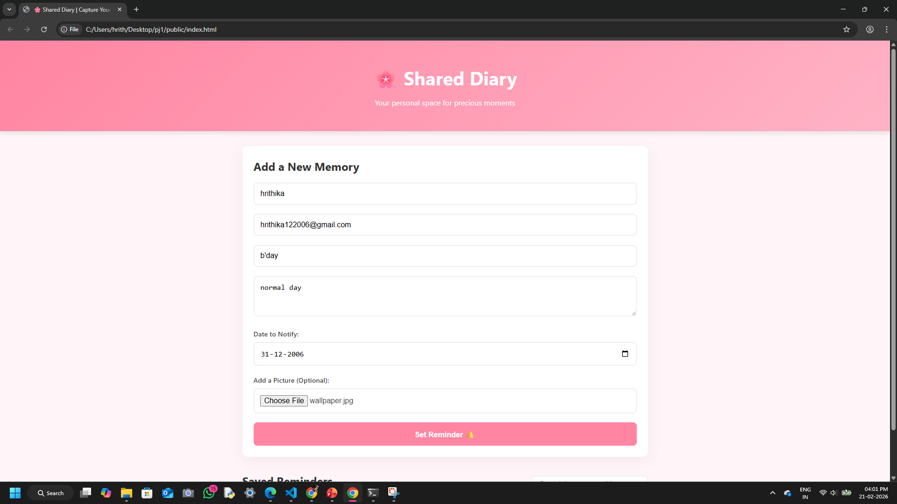

  

# Remember This - Scheduled Memory Sharing 🎯

## Basic Details

### Team Name:
hrshiv

### Team Members
- Member 1:  - Hrithika rajesh mk   college of engineering trikaripur
- Member 2: sivaranjini t.v - college of engineering trikaripur

### Project Description
"Remember This" is a web application that allows users to send scheduled digital memories (images) to other registered users. These memories become visible only on or after a selected future date, creating a nostalgic surprise experience.

### The Problem Statement
Digital memories shared through chats and social media often get lost over time. There is no simple way to schedule meaningful digital surprises for a future date.

### The Solution
This application allows users to upload an image, select a future date, and choose a recipient. The system securely stores the memory and automatically reveals it to the recipient through a popup notification when the scheduled date arrives.

---

## Technical Details

### Technologies/Components Used

**For Software:**
- Languages used: JavaScript (Node.js), HTML5, CSS3
- Frameworks used: Express.js
- Libraries used: Multer, SQLite3
- Tools used: VS Code, Git, GitHub, Node.js

**For Hardware:**
- Not Applicable

---

## Features

- User Registration and Login Authentication
- Schedule image memories for a future date
- Automatic popup notifications for unlocked memories
- Memory history gallery (Received memories)
- Sent memories tracking with status (Pending / Seen)
- SQLite database for reliable storage
---
